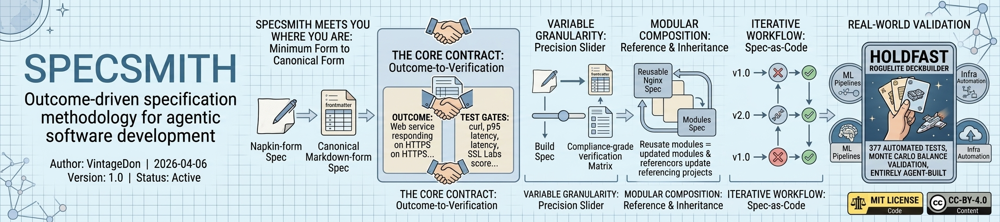
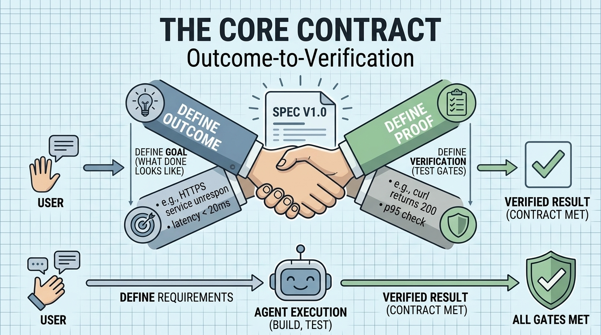
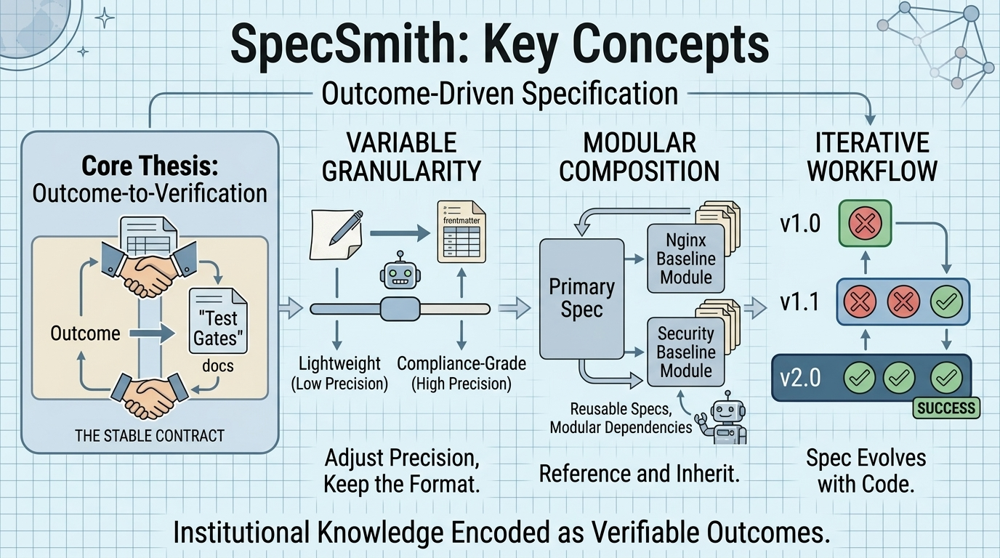

<!--
---
title: "SpecSmith"
description: "Outcome-driven specification methodology for agentic software development"
author: "VintageDon (https://github.com/vintagedon/)"
date: "2026-04-06"
version: "1.0"
status: "Active"
tags:
  - type: project-root
  - domain: methodology
related_documents:
  - "[Spec Template](spec/specsmith-spec-template.md)"
  - "[Holdfast Roguelite Deckbuilder](https://github.com/radioastronomyio/holdfast-roguelite-deckbuilder)"
---
-->

# SpecSmith

[](LICENSE)



> Outcome-driven specification methodology for agentic software development.

SpecSmith is a way of writing specs that tell agents what done looks like, then prove they got there. No CLI, no framework, no runtime dependencies. Specs are plain markdown. If you can describe what you want and explain how to verify it, you can write a SpecSmith spec.

---

## Overview

Agentic development tools keep getting more capable, but the specification side of the workflow has not kept pace. Most approaches either prescribe rigid templates with phase gates and tooling dependencies, or leave practitioners with nothing more than a blank prompt window. The first camp adds friction. The second produces inconsistent results.

SpecSmith takes a different position: the value is in the thinking that produces the spec, not the format that contains it. A spec's job is to capture two things clearly: what the outcome looks like, and how to verify the outcome was achieved. That outcome-to-verification contract is the core of the methodology. Everything else is optional structure, added when it helps and omitted when it doesn't.

The approach grew out of real agentic development work across infrastructure automation, game development, and ML pipelines. It was practiced for months before it had a name, formalized only after the patterns proved reliable across projects and domains. The primary case study is [Holdfast](https://github.com/radioastronomyio/holdfast-roguelite-deckbuilder), a roguelite deckbuilder built entirely through spec-driven agentic development by a developer with no prior game development experience.

### The Core Contract

SpecSmith is built around a stable contract: define the outcome, define the proof. The level of specificity can range from a lightweight build spec to a compliance-grade verification matrix. The contract does not change.



Start with what you want to accomplish. Then ask: how does the agent know it accomplished that? Write those two things down. That's a spec.

```yaml
# The contract at its simplest
outcome: Web service responding on HTTPS with sub-20ms latency
test_gates:
  - curl -k https://localhost returns 200
  - p95 latency < 20ms under 100 concurrent connections
  - SSL Labs score >= A
```

The spec can change precision without changing shape. A quick task might need one outcome sentence and two test gates. A compliance-sensitive deployment might need a detailed outcome matrix and dozens of gates organized into categories. Both use the same format. Both are valid, buildable, verifiable specs.

### SpecSmith Meets You Where You Are

You do not need to learn a framework to start. You do not need to install a package, configure a schema, or adopt an IDE. The methodology works on a whiteboard, a napkin, a voice memo transcribed by your phone, or a polished markdown file in version control. Whatever stage you are at, start there.

A spec written on a napkin with one outcome and one test assertion is a real spec. It can stay on the napkin, or it can mature into a canonical template with frontmatter, structured sections, and modular dependencies as the project demands. The format scales with you.

### Minimum Form and Canonical Form

SpecSmith has two expressions.

Minimum form is enough markdown to express the outcome and how to verify it. No frontmatter. No specific section structure. The barrier to entry is zero.

Canonical form is the template in this repository's [`spec/`](spec/specsmith-spec-template.md) directory. It includes YAML frontmatter, numbered sections, structured test gate tables, explicit scope boundaries, and dependency references. This form exists because it works well in practice inside a broader documentation system, not because the methodology requires it.

Use minimum form when speed matters. Use canonical form when clarity matters. Both are SpecSmith.

---

## What SpecSmith Is Not

SpecSmith is a methodology with a reference template. It is not a toolkit, CLI, IDE plugin, or framework.

| Tool | What It Is | How SpecSmith Differs |
|------|-----------|----------------------|
| GitHub Spec Kit | CLI + templates, rigid phase gates, Python setup | SpecSmith is just markdown. No install, no scaffolding. |
| OpenSpec | Node.js package, slash commands, config YAML | SpecSmith has zero runtime dependencies. |
| AWS Kiro | Full IDE fork with spec workflow built in | SpecSmith is tool-agnostic. Works with any editor, any agent. |
| forgespec-mcp | MCP server for contract validation | SpecSmith is a methodology, not a server. |

The accessibility argument is the core differentiator. If you can write markdown, you can write a SpecSmith spec. If your agent can read markdown and run tests, it can build to a SpecSmith spec.

---

## Key Concepts

Three ideas extend the core contract. Each has a dedicated document in [`methodology/`](methodology/) that will deepen as validated practice accumulates.



Granularity. The same problem can be specced at any depth. A lightweight spec has a few gates. A compliance-grade spec has a full verification matrix. The format stays the same; the precision scales. See [methodology/granularity.md](methodology/granularity.md).

Composition. Specs can reference other specs as dependencies. Write an "nginx hardened baseline" module once. Any project needing nginx references it. Update the module, and every referencing project inherits updated test criteria. Institutional knowledge encoded as verifiable outcomes. See [methodology/composition.md](methodology/composition.md).

Iteration. Specs are source controlled, versioned, diffable, and reviewable in PRs. The git history of a spec tells the story of how understanding deepened. First-pass gates miss edge cases. The spec evolves alongside the code it drives. That is the methodology working, not failing. See [methodology/iteration.md](methodology/iteration.md).

---

## Project Status

| Area | Status | Description |
|------|--------|-------------|
| Core thesis | ✅ Complete | Stable contract, variable precision, outcome-to-verification |
| Spec template | ✅ Complete | Canonical template with integrated usage guide |
| Methodology docs | ⬜ Planned | Granularity, composition, iteration (stubs present) |
| Case study writeups | ⬜ Planned | Holdfast as primary, other repos to follow |
| Holdfast spec visibility | ⬜ Planned | Un-gitignore `/spec` in Holdfast repo |

---

## Repository Structure

```markdown
specsmith/
├── methodology/               # Deeper methodology documentation
│   ├── granularity.md         # Precision slider concept
│   ├── composition.md         # Modular spec composition
│   ├── iteration.md           # Spec evolution and spec-as-code
│   └── README.md
├── docs/                      # Documentation standards
│   └── documentation-standards/
├── spec/                      # The spec template (dogfooding)
│   └── specsmith-spec-template.md
├── staging/                   # Pre-commit staging area
├── work-logs/                 # Development history
├── AGENTS.md                  # Agent context loading
├── LICENSE                    # MIT (code)
├── LICENSE-DATA               # CC-BY-4.0 (content)
└── README.md                  # This file
```

---

## Projects Using SpecSmith

| Project | Domain | Specs | Description |
|---------|--------|-------|-------------|
| [Holdfast](https://github.com/radioastronomyio/holdfast-roguelite-deckbuilder) | Game development | `/spec` (visibility pending) | Roguelite deckbuilder, 377 tests, 4 milestone cycles, Monte Carlo balance validation |

---

## Getting Started

1. Read the [spec template](spec/specsmith-spec-template.md), including its usage notes
2. Write your first spec: one outcome, two or three test gates
3. Hand it to your agent of choice and build

For the canonical template with frontmatter and structured sections, copy `spec/specsmith-spec-template.md` into your project's `/spec` directory and fill it in. For minimum form, write the outcome and gates in whatever markdown file works for your workflow.

---

## Lineage

Sean Grove's [specification-as-code presentation](https://www.youtube.com/watch?v=8rABwKRsec4) planted the seed. A retired `spec-driven-ai` repo (July 2025) was the first attempt, which tried to be the methodology, the infrastructure testbed, and the research platform simultaneously. It collapsed under its own scope.

Through months of practical agentic development across infrastructure, gaming, and ML domains, the approach refined. The interaction pattern (RAVGVR), the agent context file (AGENTS.md), and the spec-driven prompts to coding agents all proved the methodology worked. SpecSmith was formalized after the proof existed, not before.

---

## License

- Code: [MIT License](LICENSE)
- Data/Content: [CC-BY-4.0](LICENSE-DATA)

---

Last Updated: April 6, 2026 | Status: Active
